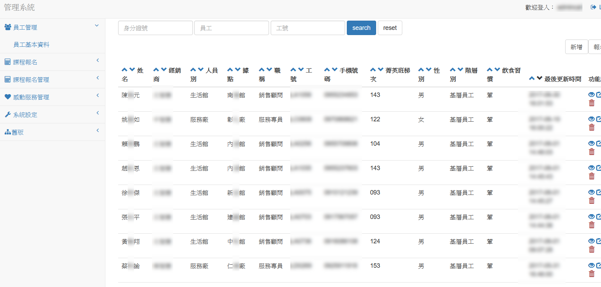
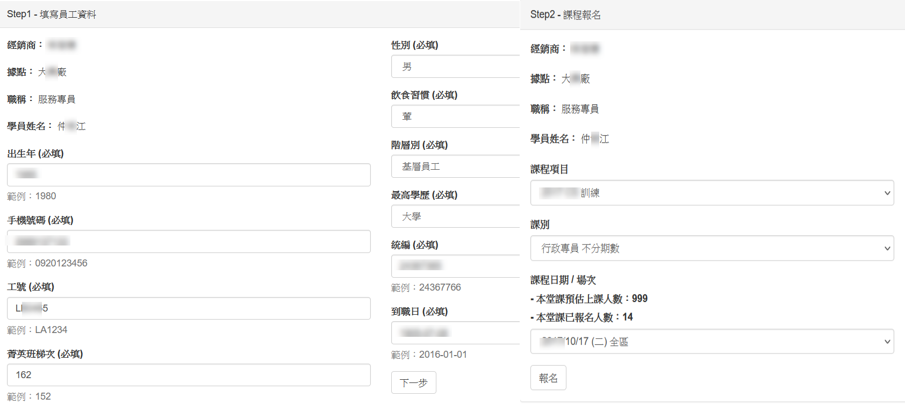
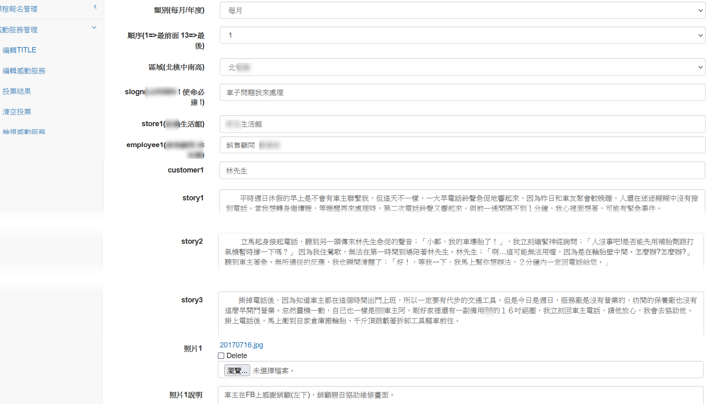
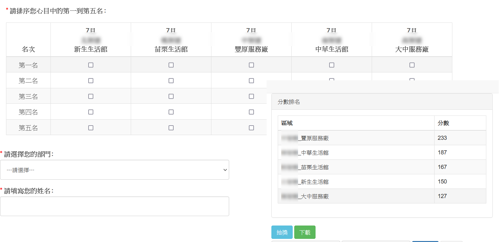
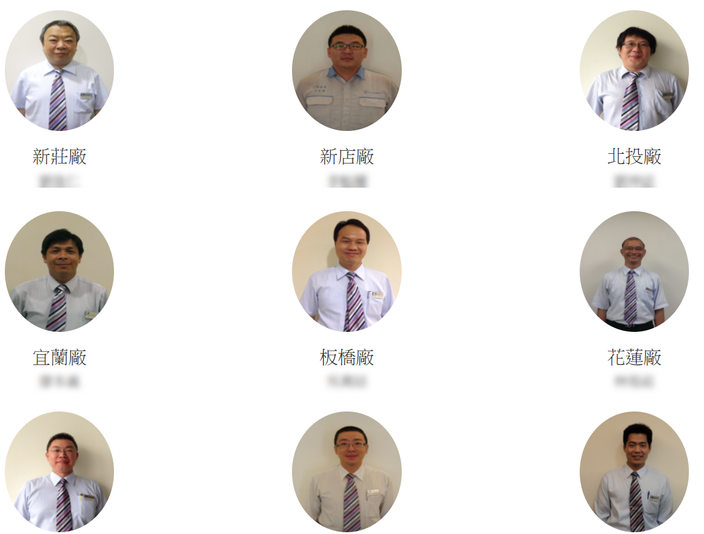

#教育訓練報名與激勵系統

#主要功能

##員工管理

###員工基本資料管理

新增/修改/刪除

員工基本資料/大頭照上傳

##課程報名

##課程報名管理

新增/修改/刪除

課程分為三層類別
 
    -- 場次
    -- 客別
    -- 課程

## 最佳員工投票

### 每月最佳員工票選 – 文案編輯

### 每月最佳員工票選 – 投票與統計

### 年度最佳員工票選 – 相片牆

##系統設定

### 據點管理
### 員工管理
### 職稱管理

新增/修改/刪除